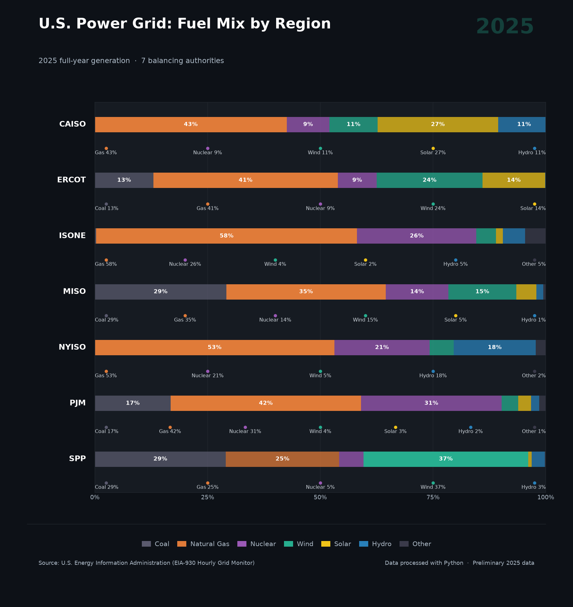

# U.S. Power Grid: Fuel Mix by Region (2025)

Visualization of electricity generation fuel mix across 7 major U.S. balancing authorities, built with Python and matplotlib using hourly EIA-930 data.


## Overview

This project analyzes full-year 2025 hourly generation data from the U.S. Energy Information Administration (EIA-930 Hourly Electric Grid Monitor) across 7 balancing authorities:

| Code | Region |
|------|--------|
| CAISO | California ISO |
| ERCOT | Electric Reliability Council of Texas |
| ISONE | ISO New England |
| MISO | Midcontinent ISO |
| NYISO | New York ISO |
| PJM | PJM Interconnection |
| SPP | Southwest Power Pool |

## Key Findings

- **SPP** leads in wind generation (37%) — more than coal and gas combined
- **PJM** has the highest nuclear share (31%) of any region
- **ISONE** is the most gas-dependent grid (58%)
- **CAISO** has the highest solar penetration (27%)
- Natural gas remains the dominant fuel in 6 out of 7 regions

## Data Source

**U.S. Energy Information Administration — EIA-930 Hourly Electric Grid Monitor**  
Balancing Authority files, downloaded from:  
https://www.eia.gov/electricity/gridmonitor/

- File type: Per-BA `.xlsx` files (Balancing Authority / Region Files section)
- Coverage: January–December 2025 (preliminary)
- Fuel types used: Coal, Natural Gas, Nuclear, Wind, Solar, Hydro, Other

## Project Structure

```
├── eia_fuel_mix_2025.py           # Main script
├── iso_fuel_mix_2025_linkedin.png # Output visualization
├── eia_Data/                      # Raw data directory (not included)
│   ├── CISO.xlsx
│   ├── ERCO.xlsx
│   ├── ISNE.xlsx
│   ├── MISO.xlsx
│   ├── NYIS.xlsx
│   ├── PJM.xlsx
│   └── SWPP.xlsx
└── README.md
```

## Requirements

```bash
pip install pandas matplotlib openpyxl
```

## Usage

1. Download BA files from [EIA-930 Grid Monitor](https://www.eia.gov/electricity/gridmonitor/) → Download Data → Balancing Authority / Region Files
2. Place files in `eia_Data/` folder
3. Update `DATA_DIR` in the script if needed
4. Run:

```bash
python eia_fuel_mix_2025.py
```

Output saved as `iso_fuel_mix_2025.png`.

## Tech Stack

- Python 3.12
- pandas — data loading and aggregation
- matplotlib — visualization (no Plotly/Kaleido dependencies)

## Notes

- Data is preliminary for 2025; final figures may differ slightly
- `eia_Data/` folder is excluded from the repo; download raw files directly from EIA
